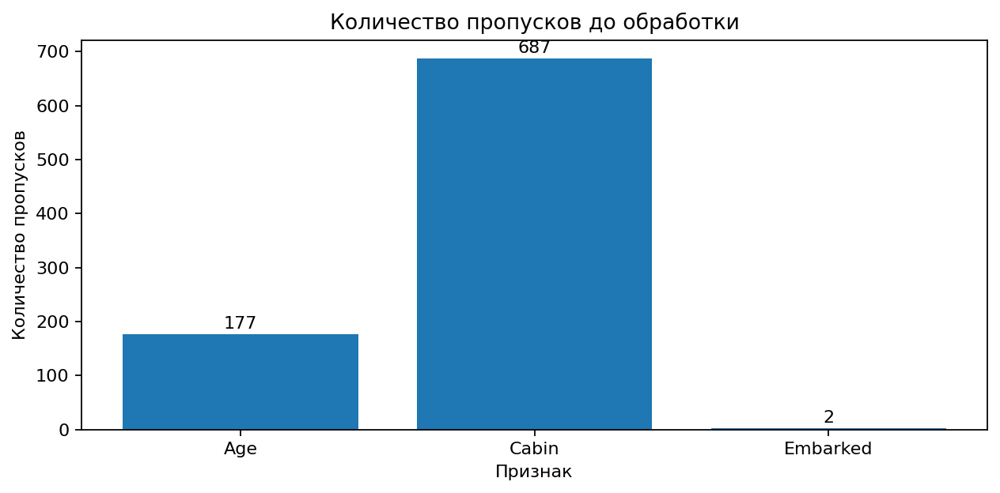
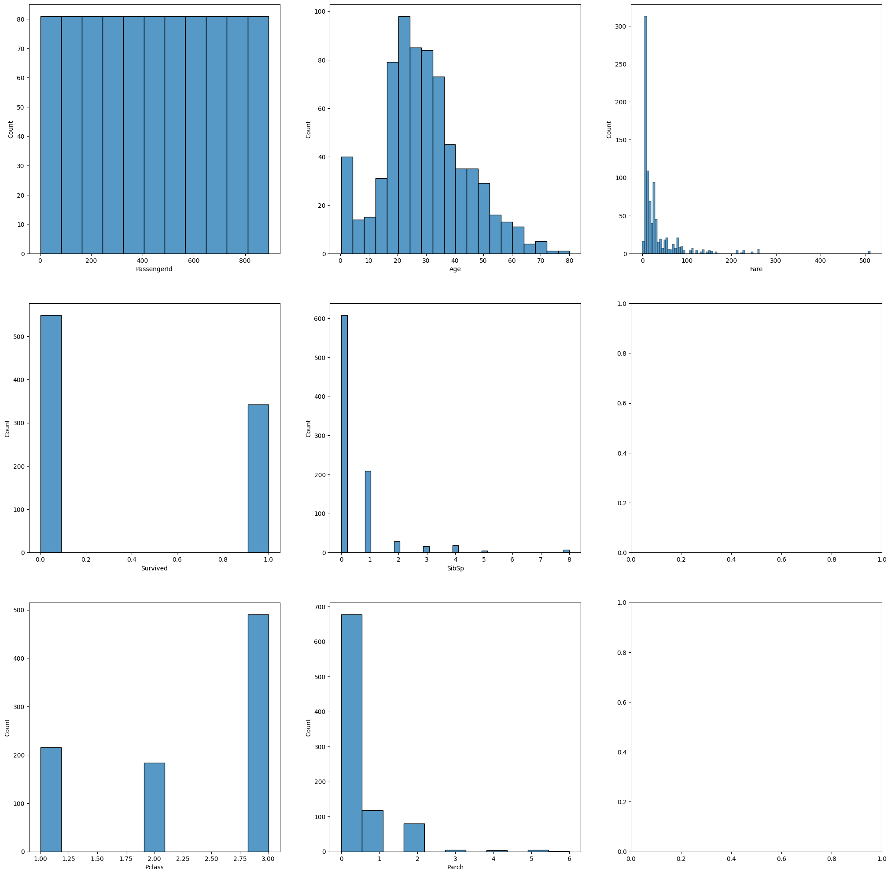
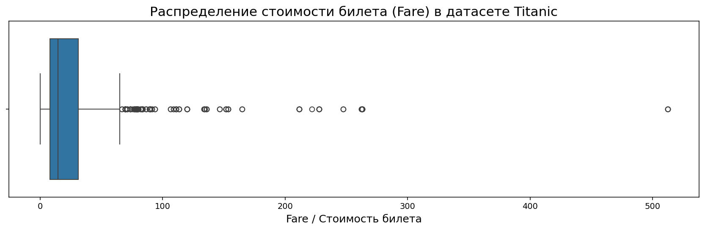
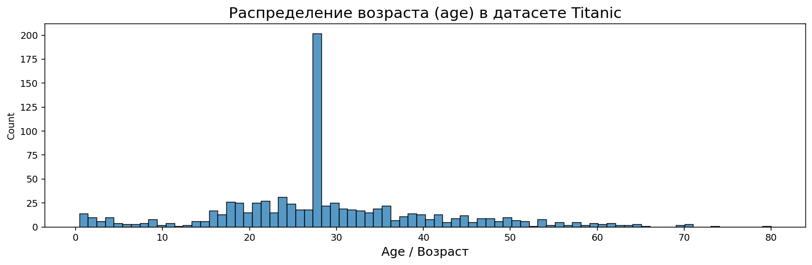
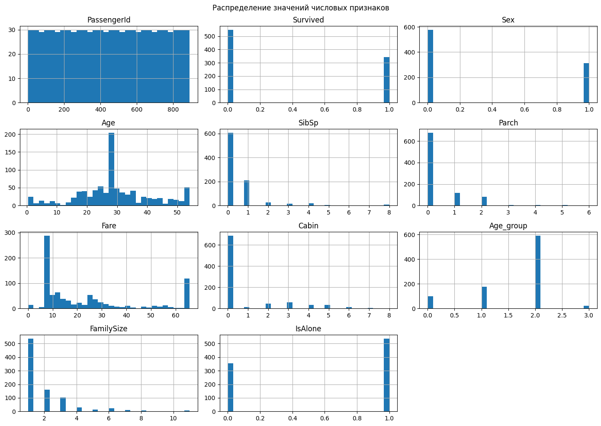
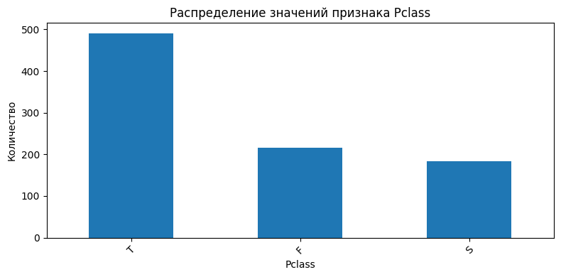
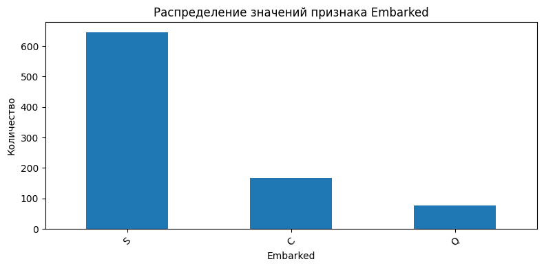
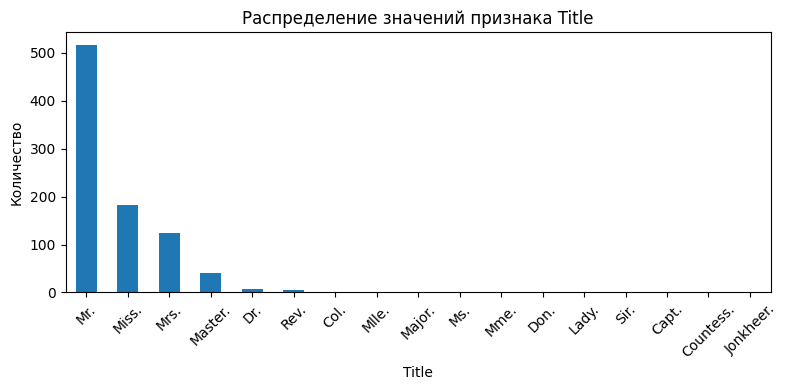
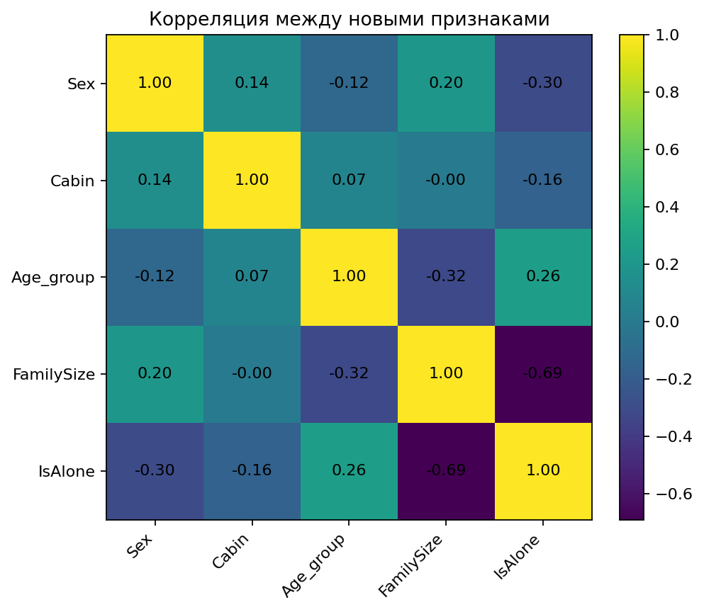

# Лабораторная работа №6. Очистка и трансформация данных. pandas

**Выполнил:** Окунев Никита Дмитриевич  
**Группа:** P3122  
**Среда выполнения:** Google Colab  
**Ссылка на блокнот:** [открыть Google Colab](https://colab.research.google.com/drive/1Oq5VTNT3dMBvHd6cUPSIJTLtxduq8UKy?usp=sharing)

---

## Введение

В данной лабораторной работе выполнена предобработка набора данных `Titanic`. Работа включает первичный анализ датафрейма, поиск и заполнение пропусков, создание новых признаков, преобразование типов данных, обработку выбросов, агрегацию данных и расчёт метрик качества очистки.

В ходе работы использовались библиотеки `pandas`, `matplotlib`, `seaborn`, `numpy`.

---

## Цель работы

Цель работы — освоить методы очистки и трансформации данных с использованием библиотеки `pandas` на примере реального набора данных `Titanic`.

В рамках работы были выполнены следующие действия:

- загрузка и первичный анализ данных;
- проверка типов данных и пропусков;
- получение статистических характеристик числовых признаков;
- визуализация распределений;
- обработка пропущенных значений;
- создание новых признаков;
- преобразование типов данных;
- выявление и обработка выбросов;
- агрегация данных;
- расчёт метрик качества очистки;
- сохранение очищенного датасета.

---

## Описание набора данных

Используемый набор данных — `Titanic` с Kaggle: [Titanic: Machine Learning from Disaster](https://www.kaggle.com/c/titanic/data).  
В ноутбуке данные загружались из CSV-файла `train.csv` через GitHub-зеркало.

Исходный датафрейм содержит **891 строку** и **12 столбцов**.

| Признак | Тип до обработки | Описание | Роль в анализе |
|---|---:|---|---|
| `PassengerId` | `int64` | идентификатор пассажира | технический идентификатор |
| `Survived` | `int64` | факт выживания: `0` — не выжил, `1` — выжил | целевой признак для анализа выживаемости |
| `Pclass` | `int64` | класс билета | социально-экономический признак |
| `Name` | `object` | имя пассажира | источник для создания признака `Title` |
| `Sex` | `object` | пол пассажира | категориальный признак, далее преобразован в `0/1` |
| `Age` | `float64` | возраст пассажира | числовой признак с пропусками |
| `SibSp` | `int64` | количество братьев/сестёр/супругов на борту | используется для создания `FamilySize` |
| `Parch` | `int64` | количество родителей/детей на борту | используется для создания `FamilySize` |
| `Ticket` | `object` | номер билета | категориальный идентификатор |
| `Fare` | `float64` | стоимость билета | числовой признак с выбросами |
| `Cabin` | `object` | номер каюты | признак с большим количеством пропусков |
| `Embarked` | `object` | порт посадки | категориальный признак с пропусками |

---

## Первичный анализ

### Загрузка данных

В ноутбуке датасет был загружен командой:

```python
!wget https://raw.githubusercontent.com/rebeccabilbro/titanic/refs/heads/master/data/train.csv
train = pd.read_csv('train.csv')
```

Первые 10 строк датафрейма были выведены в ноутбуке для визуальной проверки структуры данных. В README они не дублируются, так как основной отчёт ориентирован на результаты анализа.

### Типы данных и размер датафрейма

До обработки датафрейм имел следующую структуру:

| Показатель | Значение |
|---|---:|
| Количество строк | 891 |
| Количество столбцов | 12 |
| Количество `float64`-столбцов | 2 |
| Количество `int64`-столбцов | 5 |
| Количество `object`-столбцов | 5 |
| Использование памяти | 83.7+ KB |

| Столбец | Непустых значений | Тип данных |
|---|---:|---|
| `PassengerId` | 891 | `int64` |
| `Survived` | 891 | `int64` |
| `Pclass` | 891 | `int64` |
| `Name` | 891 | `object` |
| `Sex` | 891 | `object` |
| `Age` | 714 | `float64` |
| `SibSp` | 891 | `int64` |
| `Parch` | 891 | `int64` |
| `Ticket` | 891 | `object` |
| `Fare` | 891 | `float64` |
| `Cabin` | 204 | `object` |
| `Embarked` | 889 | `object` |

### Пропущенные значения

На этапе первичного анализа были выявлены пропуски в трёх столбцах.

| Столбец | Количество пропусков | Доля от 891 строк |
|---|---:|---:|
| `Age` | 177 | 19.87% |
| `Cabin` | 687 | 77.10% |
| `Embarked` | 2 | 0.22% |



**Особенность:** дополнительно были проверены уникальные значения в столбцах. Скрытых пропусков вида `unknown` обнаружено не было.

### Статистика датафрейма

Для числовых признаков были рассчитаны минимальное значение, максимальное значение, медиана и среднее.

| Признак | Минимум | Максимум | Медиана | Среднее |
|---|---:|---:|---:|---:|
| `PassengerId` | 1 | 891 | 446.0 | 446.0000 |
| `Survived` | 0 | 1 | 0.0 | 0.3838 |
| `Pclass` | 1 | 3 | 3.0 | 2.3086 |
| `Age` | 0.42 | 80.0 | 28.0 | 29.6991 |
| `SibSp` | 0 | 8 | 0.0 | 0.5230 |
| `Parch` | 0 | 6 | 0.0 | 0.3816 |
| `Fare` | 0.0 | 512.3292 | 14.4542 | 32.2042 |

### Визуализация числовых признаков



По графикам видно, что признаки имеют разные масштабы и распределения. `PassengerId` фактически является идентификатором, `Survived` и `Pclass` являются дискретными признаками, а `Fare` имеет выраженную правую асимметрию из-за дорогих билетов.

---

## Обработка пропусков

### Методы заполнения

В работе были использованы фактически реализованные в ноутбуке методы обработки пропусков.

| Столбец | Проблема | Метод обработки | Результат |
|---|---|---|---|
| `Age` | 177 пропусков | заполнение медианой | пропуски заменены на `28.0` |
| `Embarked` | 2 пропуска | заполнение модой | пропуски заменены на `S` |
| `Cabin` | 687 пропусков | извлечение первой буквы каюты, кодирование и замена `NaN` на `0` | создана числовая кодировка кают |

Код обработки `Age`:

```python
med = train['Age'].median()
print(f'Медианное значение признака Age: {med}')
train['Age'] = train['Age'].fillna(med)
```

Результат:

| Показатель | Значение |
|---|---:|
| Медиана `Age` | 28.0 |
| Количество заполненных пропусков `Age` | 177 |

Код обработки `Embarked`:

```python
embarked_mode = train['Embarked'].mode()[0]
print(f'Наиболее встречающееся значение в Embarked: {embarked_mode}')
train['Embarked'] = train['Embarked'].fillna(embarked_mode)
```

Результат:

| Показатель | Значение |
|---|---|
| Мода `Embarked` | `S` |
| Уникальные значения после обработки | `S`, `C`, `Q` |

Код обработки `Cabin`:

```python
cabin_mapper = {
    'A': 1,
    'B': 2,
    'C': 3,
    'D': 4,
    'E': 5,
    'F': 6,
    'G': 7,
    'T': 8
}

train['Cabin'] = (
    train['Cabin']
    .str[0]
    .map(cabin_mapper)
    .fillna(0)
    .astype(int)
)
```

После обработки `Cabin` получил значения:

```text
[0, 3, 5, 7, 4, 1, 2, 6, 8]
```

Значение `0` соответствует отсутствующей каюте, остальные значения соответствуют первой букве каюты.

### Результаты обработки

После обработки пропусков в столбцах `Age`, `Cabin`, `Embarked` пропуски отсутствуют.

| Столбец | Было пропусков | Стало пропусков | Результат |
|---|---:|---:|---|
| `Age` | 177 | 0 | заполнено медианой |
| `Cabin` | 687 | 0 | закодировано с заменой `NaN` на `0` |
| `Embarked` | 2 | 0 | заполнено модой |

**Процент заполненных пропусков:** 100%.

---

## Трансформация данных

### Созданные признаки

В ходе работы были созданы новые признаки.

| Новый признак | Источник | Правило формирования | Назначение |
|---|---|---|---|
| `Age_group` | `Age` | разбиение возраста на группы | анализ выживаемости по возрастным категориям |
| `Title` | `Name` | извлечение обращения по слову, оканчивающемуся на точку | выделение социального обращения пассажира |
| `FamilySize` | `SibSp`, `Parch` | `SibSp + Parch + 1` | размер семьи пассажира на борту |
| `IsAlone` | `FamilySize` | `1`, если пассажир один; иначе `0` | бинарный признак одиночного пассажира |
| `Priority_level` | `Title` | авторская группировка обращений по социальному статусу | дополнительный анализ связи статуса и выживаемости |

Код создания `Age_group`:

```python
train['Age_group'] = [0] * len(train)

for i in range(len(train)):
    age = train.iloc[i]['Age']

    if age > 60:
        train.loc[i, 'Age_group'] = 3
    elif 60 >= age > 24:
        train.loc[i, 'Age_group'] = 2
    elif 24 >= age > 16:
        train.loc[i, 'Age_group'] = 1
    elif 16 >= age > 0:
        train.loc[i, 'Age_group'] = 0
```

Распределение по возрастным группам после заполнения `Age`:

| Код `Age_group` | Интервал возраста | Количество пассажиров |
|---:|---|---:|
| 0 | `0 < Age <= 16` | 100 |
| 1 | `16 < Age <= 24` | 177 |
| 2 | `24 < Age <= 60` | 592 |
| 3 | `Age > 60` | 22 |

Код создания `Title`:

```python
train['Title'] = ['N/A'] * len(train)

for i in range(len(train)):
    name = train.iloc[i]['Name']
    words = name.split()

    for word in words:
        if len(word) != 0 and word[-1] == '.':
            social_rank = word
            break

    train.loc[i, 'Title'] = social_rank
    train.loc[i, 'Name'] = name.replace(social_rank + ' ', '')
```

Найденные значения `Title`:

```text
Mr., Mrs., Miss., Master., Don., Rev., Dr., Mme., Ms., Major., Lady., Sir., Mlle., Col., Capt., Countess., Jonkheer.
```

Код создания `FamilySize` и `IsAlone`:

```python
train['FamilySize'] = [1] * len(train)
train['IsAlone'] = [0] * len(train)

for i in range(len(train)):
    SibSp = train.iloc[i]['SibSp']
    Parch = train.iloc[i]['Parch']

    train.loc[i, 'FamilySize'] += SibSp + Parch

    if SibSp == Parch == 0:
        train.loc[i, 'IsAlone'] = 1
```

Уникальные значения `FamilySize`:

```text
[2, 1, 5, 3, 7, 6, 4, 8, 11]
```

### Преобразования типов

| Признак | Было | Стало | Правило |
|---|---|---|---|
| `Pclass` | `int64` | `object` | `1 -> F`, `2 -> S`, `3 -> T` |
| `Sex` | `object` | `int64` | `male -> 0`, `female -> 1` |
| `Cabin` | `object` | `int64` | первая буква каюты преобразована в число, пропуски заменены на `0` |

Код преобразования `Pclass`:

```python
train['Pclass'] = train['Pclass'].map({1: 'F', 2: 'S', 3: 'T'})
```

После преобразования `Pclass` содержит значения:

```text
['T', 'F', 'S']
```

Код преобразования `Sex`:

```python
train['Sex'] = train['Sex'].map({'male': 0, 'female': 1})
```

После преобразования `Sex` содержит значения:

```text
[0, 1]
```

---

## Обработка выбросов

### Выявленные выбросы

Для признака `Fare` был построен boxplot.



Выбросы для `Fare` были определены с помощью IQR-метода.

Формулы метода:

```text
IQR = Q3 - Q1
lower_bound = Q1 - 1.5 * IQR
upper_bound = Q3 + 1.5 * IQR
```

Вычисленные значения:

| Показатель | Значение |
|---|---:|
| `Q1` | 7.9104 |
| `Q3` | 31.0000 |
| `IQR` | 23.0896 |
| Нижняя граница | -26.7240 |
| Верхняя граница | 65.6344 |

Так как нижняя граница отрицательная, а `Fare` не принимает отрицательных значений, фактически выбросами являются значения `Fare` выше `65.6344`.

Примеры найденных выбросов из первых строк таблицы `outliers.head(10)`:

| `PassengerId` | `Pclass` | `Sex` | `Age` | `Fare` | `Cabin` | `Embarked` | `Title` | `FamilySize` | `IsAlone` |
|---:|---|---:|---:|---:|---:|---|---|---:|---:|
| 2 | F | 1 | 38.0 | 71.2833 | 3 | C | Mrs. | 2 | 0 |
| 28 | F | 0 | 19.0 | 263.0000 | 3 | S | Mr. | 6 | 0 |
| 32 | F | 1 | 28.0 | 146.5208 | 2 | C | Mrs. | 2 | 0 |
| 35 | F | 0 | 28.0 | 82.1708 | 0 | C | Mr. | 2 | 0 |
| 53 | F | 1 | 49.0 | 76.7292 | 4 | C | Mrs. | 2 | 0 |
| 62 | F | 1 | 38.0 | 80.0000 | 2 | S | Miss. | 1 | 1 |
| 63 | F | 0 | 45.0 | 83.4750 | 3 | S | Mr. | 2 | 0 |
| 73 | S | 0 | 21.0 | 73.5000 | 0 | S | Mr. | 1 | 1 |
| 89 | F | 1 | 23.0 | 263.0000 | 3 | S | Miss. | 6 | 0 |
| 103 | F | 0 | 21.0 | 77.2875 | 4 | S | Mr. | 2 | 0 |

Дополнительно было визуализировано распределение `Age`.



Перед обработкой возраст находился в диапазоне от `0.42` до `80.0`.

### Методы обработки

Для `Fare` была применена winsorization через `clip` по границам IQR-метода:

```python
train['Fare'] = train['Fare'].clip(lower=lower_bound, upper=upper_bound)
```

После этого значения `Fare`, превышающие `65.6344`, были заменены на `65.6344`.

Для `Age` экстремальные значения были ограничены 95-м перцентилем:

```python
Q95 = train['Age'].quantile(0.95)
train['Age'] = train['Age'].clip(upper=Q95)
```

Результат:

| Показатель | Значение |
|---|---:|
| 95-й перцентиль `Age` | 54.0 |
| Максимальное значение `Age` после ограничения | 54.0 |

---

## Агрегация и анализ

### Сводные статистики

Среднее значение `Survived` по классам `Pclass`:

| `Pclass` | Средняя выживаемость |
|---|---:|
| `F` | 0.63 |
| `S` | 0.47 |
| `T` | 0.24 |

**Вывод:** наибольшая средняя выживаемость наблюдается у пассажиров класса `F`, наименьшая — у пассажиров класса `T`.

Группировка по `Pclass` и `Sex` была создана с помощью:

```python
train_grouped = train.groupby(['Pclass', 'Sex'])
```

Для `Embarked` в ноутбуке фактически была рассчитана агрегация `mean()` по `Age`.

| `Embarked` | Средний `Age` |
|---|---:|
| `C` | 29.7317 |
| `Q` | 27.6364 |
| `S` | 28.9509 |

### Сводная таблица выживаемости по новым признакам

Выживаемость по `Age_group`:

| `Age_group` | Средняя выживаемость |
|---:|---:|
| 0 | 0.55 |
| 1 | 0.36 |
| 2 | 0.37 |
| 3 | 0.23 |

Выживаемость по `Cabin`:

| `Cabin` | Средняя выживаемость |
|---:|---:|
| 0 | 0.30 |
| 1 | 0.47 |
| 2 | 0.74 |
| 3 | 0.59 |
| 4 | 0.76 |
| 5 | 0.75 |
| 6 | 0.62 |
| 7 | 0.50 |
| 8 | 0.00 |

Выживаемость по `Title`:

| `Title` | Средняя выживаемость |
|---|---:|
| `Capt.` | 0.00 |
| `Col.` | 0.50 |
| `Countess.` | 1.00 |
| `Don.` | 0.00 |
| `Dr.` | 0.43 |
| `Jonkheer.` | 0.00 |
| `Lady.` | 1.00 |
| `Major.` | 0.50 |
| `Master.` | 0.57 |
| `Miss.` | 0.70 |
| `Mlle.` | 1.00 |
| `Mme.` | 1.00 |
| `Mr.` | 0.16 |
| `Mrs.` | 0.79 |
| `Ms.` | 1.00 |
| `Rev.` | 0.00 |
| `Sir.` | 1.00 |

Выживаемость по `Sex`:

| `Sex` | Средняя выживаемость |
|---:|---:|
| 0 | 0.19 |
| 1 | 0.74 |

Здесь `0` соответствует `male`, `1` соответствует `female`.

Выживаемость по `FamilySize`:

| `FamilySize` | Средняя выживаемость |
|---:|---:|
| 1 | 0.30 |
| 2 | 0.55 |
| 3 | 0.58 |
| 4 | 0.72 |
| 5 | 0.20 |
| 6 | 0.14 |
| 7 | 0.33 |
| 8 | 0.00 |
| 11 | 0.00 |

Выживаемость по `IsAlone`:

| `IsAlone` | Средняя выживаемость |
|---:|---:|
| 0 | 0.51 |
| 1 | 0.30 |

**Выводы по агрегации:**

- пассажиры класса `F` имели более высокую среднюю выживаемость, чем пассажиры классов `S` и `T`;
- средняя выживаемость женщин (`Sex = 1`) существенно выше средней выживаемости мужчин (`Sex = 0`);
- одиночные пассажиры (`IsAlone = 1`) имели меньшую среднюю выживаемость, чем пассажиры, путешествовавшие не одни;
- наилучшая средняя выживаемость по `FamilySize` наблюдается при размере семьи `4`;
- среди возрастных групп наибольшая средняя выживаемость у группы `Age_group = 0`.

### Визуализации

Распределения числовых признаков после трансформации:



Распределение категориального признака `Pclass`:



Распределение категориального признака `Embarked`:



Распределение категориального признака `Title`:



---

## Метрики качества очистки данных

### Процент заполненных пропусков

После обработки данные имеют **891 строку** и **16 столбцов**.

| Показатель | Значение |
|---|---:|
| Количество строк после обработки | 891 |
| Количество столбцов после обработки | 16 |
| Количество пропусков в `Age` | 0 |
| Количество пропусков в `Cabin` | 0 |
| Количество пропусков в `Embarked` | 0 |
| Процент заполненных пропусков | 100% |

Итоговая структура датафрейма после обработки:

| Столбец | Непустых значений | Тип данных |
|---|---:|---|
| `PassengerId` | 891 | `int64` |
| `Survived` | 891 | `int64` |
| `Pclass` | 891 | `object` |
| `Name` | 891 | `object` |
| `Sex` | 891 | `int64` |
| `Age` | 891 | `float64` |
| `SibSp` | 891 | `int64` |
| `Parch` | 891 | `int64` |
| `Ticket` | 891 | `object` |
| `Fare` | 891 | `float64` |
| `Cabin` | 891 | `int64` |
| `Embarked` | 891 | `object` |
| `Age_group` | 891 | `int64` |
| `Title` | 891 | `object` |
| `FamilySize` | 891 | `int64` |
| `IsAlone` | 891 | `int64` |

### Количество уникальных значений в категориальных признаках

| Признак | Количество уникальных значений |
|---|---:|
| `Pclass` | 3 |
| `Name` | 891 |
| `Ticket` | 681 |
| `Embarked` | 3 |
| `Title` | 17 |

### Корреляция между новыми признаками

Корреляция была рассчитана для признаков:

```python
new_features = [
    'Sex',
    'Cabin',
    'Age_group',
    'FamilySize',
    'IsAlone'
]

correlation_matrix = train[new_features].corr().round(4)
```

| Признак | `Sex` | `Cabin` | `Age_group` | `FamilySize` | `IsAlone` |
|---|---:|---:|---:|---:|---:|
| `Sex` | 1.0000 | 0.1435 | -0.1242 | 0.2010 | -0.3036 |
| `Cabin` | 0.1435 | 1.0000 | 0.0687 | -0.0031 | -0.1559 |
| `Age_group` | -0.1242 | 0.0687 | 1.0000 | -0.3175 | 0.2591 |
| `FamilySize` | 0.2010 | -0.0031 | -0.3175 | 1.0000 | -0.6909 |
| `IsAlone` | -0.3036 | -0.1559 | 0.2591 | -0.6909 | 1.0000 |



Наиболее выраженная связь наблюдается между `FamilySize` и `IsAlone`: корреляция равна `-0.6909`. Это логично, так как признак `IsAlone` напрямую связан с размером семьи.

### Дополнительный авторский анализ `Priority_level`

В ноутбуке дополнительно был создан признак `Priority_level`, основанный на группировке `Title`:

- `0` — обращения по социальному статусу: `Mr.`, `Mrs.`, `Miss.`, `Master.`, `Mme.`, `Mlle.`, `Ms.`;
- `1` — профессиональные обращения: `Dr.`, `Rev.`;
- `2` — воинские звания и чины аристократии: `Capt.`, `Major.`, `Col.`, `Lady.`, `Sir.`, `Countess.`, `Don.`, `Jonkheer.`.

Корреляция `Priority_level` и `Survived`:

| Признак | `Priority_level` | `Survived` |
|---|---:|---:|
| `Priority_level` | 1.0000 | 0.0032 |
| `Survived` | 0.0032 | 1.0000 |

**Вывод:** связь между `Priority_level` и `Survived` практически отсутствует, так как коэффициент корреляции равен `0.0032`.

---

## Полученные файлы

В результате выполнения работы были получены следующие файлы:

| Файл / папка | Назначение |
|---|---|
| `README.md` | отчёт по лабораторной работе |
| `images/` | изображения графиков для README |
| `Titanic_dataset_train_cleaned.csv` | очищенный датасет, сохраняемый в ноутбуке |

В ноутбуке сохранение очищенных данных выполнено командой:

```python
train.to_csv('Titanic_dataset_train_cleaned.csv')
```

---

## Заключение

### Результаты работы

В ходе лабораторной работы был выполнен полный цикл базовой предобработки данных на примере датасета `Titanic`.

Были выполнены следующие этапы:

- загружен исходный CSV-файл;
- выполнен первичный анализ структуры датафрейма;
- определены типы данных и количество пропусков;
- рассчитаны статистические характеристики числовых признаков;
- построены графики распределения числовых и категориальных признаков;
- обработаны пропуски в `Age`, `Cabin`, `Embarked`;
- созданы новые признаки `Age_group`, `Title`, `FamilySize`, `IsAlone`;
- преобразованы признаки `Pclass`, `Sex`, `Cabin`;
- выявлены выбросы в `Fare` с помощью IQR-метода;
- выполнена winsorization для `Fare`;
- экстремальные значения `Age` ограничены 95-м перцентилем;
- построены сводные статистики выживаемости;
- рассчитаны метрики качества очистки данных;
- рассчитана корреляция между новыми признаками;
- очищенный датасет сохранён в CSV-файл.

### Выводы

Обработка пропусков позволила привести ключевые признаки `Age`, `Cabin`, `Embarked` к состоянию без отсутствующих значений. Процент заполненных пропусков составил 100%.

Трансформация признаков расширила исходный набор данных с 12 до 16 столбцов. Новые признаки дали возможность анализировать выживаемость не только по исходным данным, но и по возрастным группам, размеру семьи, факту одиночного путешествия и обращениям из имени пассажира.

Анализ выживаемости показал, что наибольшее влияние на средние значения `Survived` визуально и статистически проявляется у признаков `Sex`, `Pclass`, `IsAlone`, `FamilySize` и отдельных значений `Title`. Женщины имели более высокую среднюю выживаемость, чем мужчины; пассажиры класса `F` имели более высокую среднюю выживаемость, чем пассажиры классов `S` и `T`; пассажиры, путешествовавшие не одни, в среднем выживали чаще, чем одиночные пассажиры.

Обработка выбросов уменьшила влияние экстремально высоких значений `Fare` и больших значений `Age`. Для `Fare` использовалась граница IQR-метода `65.6344`, для `Age` — 95-й перцентиль, равный `54.0`.

Корреляционный анализ новых признаков показал наиболее сильную связь между `FamilySize` и `IsAlone`, что объясняется логикой построения этих признаков. Дополнительный признак `Priority_level` практически не связан с `Survived`, так как коэффициент корреляции составил `0.0032`.

**Ссылка на блокнот:** [открыть Google Colab](https://colab.research.google.com/drive/1Oq5VTNT3dMBvHd6cUPSIJTLtxduq8UKy?usp=sharing)
